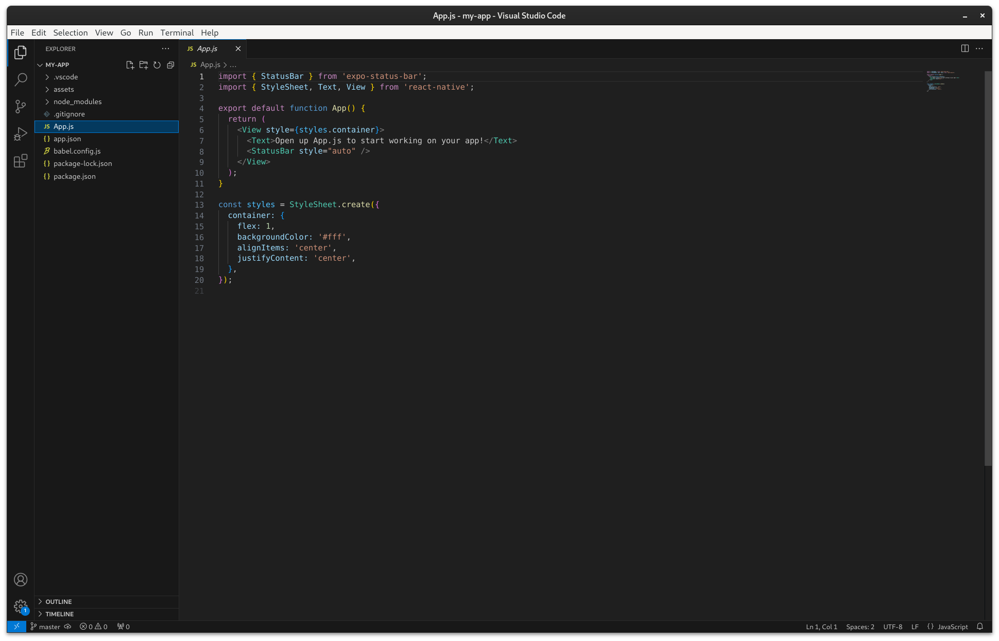

<div>
  <h1 align="center">Minimalist VSCode</h1>
</div>

## Before:

    
## After:


## About:
If you, like me, are tired of the default look and feel of VSCode, here's some good news: you can modify it to be very minimalist, hiding unnecessary elements and creating a clean appearance. I have done this on `Linux Ubuntu`, but it can be done on `Mac` and `Windows` as well.

## Plugins:
Here is a list of plugins that make this possible:
- **APC Customize UI++:** This allows us to customize VSCode beyond its scope.
- **Symbols:** These are the icons for your VSCode.
- **Min Theme:** This theme enables the nice color scheme shown.
- **Prettier - Code Formatter:** This ensures consistent style in your code formatting.

## JetBrains Mono Font
Created by JetBrains, this is, in my opinion, the best font for developers. Please download it if you want your setup to look like the image above: [JetBrains Mono Download](https://www.jetbrains.com/lp/mono/). 

After unpacking it, open your terminal and type:
```
sudo cp -r JetBrainsMono-2.304 /usr/share/fonts/
```
Open `GNOME Tweaks` and in Fonts select `JetBrains Mono Regular`:


## Getting Started:
To enable the APC plugin and customize our VSCode, type: 
* For Mac:
    `⌘` + `Shift` + `P` 
    
* For Windows: 
    `Ctrl` + `Shift` + `P`

Find `Enable APC extension`, click there, and a restart of VSCode may be required. `ATTENTION:` This plugin is experimental, so back up your VSCode settings in case something goes wrong.

If you are on Linux, open the terminal and type:
```
sudo chown -R {your_username} /usr/share/code
```
Restart VSCode and try enabling the APC plugin again; it should now work fine.

## JSON Settings:
Now, press:
* For Mac:
    `⌘` + `Shift` + `P` 
    
* For Windows: 
    `Ctrl` + `Shift` + `P`

And click on `Preferences: Open User Settings`. In the `User` tab, find `> Extensions`, open it, and click on `APC`. Once there, click on any `Edit in settings.json`.

After opening `settings.json`, copy and paste this JSON: [HERE](https://github.com/mavinii/Minimalist-VSCode/blob/main/settings.json), restart your VSCode and it should good to go.

---

<strong>Created by [@Eduardo Dias](https://www.linkedin.com/in/eduardxdc/)</strong>
